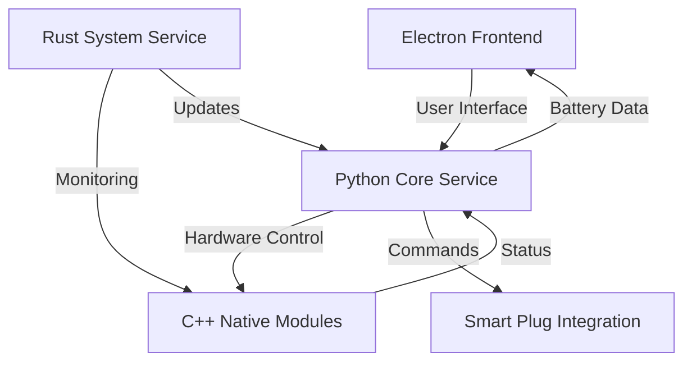

```mermaid
graph TD
    A[Electron Frontend] -->|User Interface| B[Python Core Service]
    B -->|Battery Data| A
    B -->|Hardware Control| C[C++ Native Modules]
    C -->|Status| B
    D[Rust System Service] -->|Monitoring| C
    D -->|Updates| B
    B -->|Commands| E[Smart Plug Integration]
```
